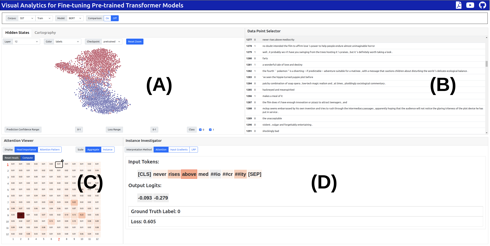

# T<sup>3</sup>-Vis

T<sup>3</sup>-Vis is a visual analytic framework designed to assist in the training and fine-tuning of Transformer-based models.




## Install and Getting Started

We suggest installing within a virtual environment such as `virtualenv` or [`conda`](https://docs.conda.io/en/latest/)

```sh
git clone https://github.com/raymondzmc/T3-Vis.git ~/T3-Vis

# Set up Python environment
cd ~/T3-Vis
pip3 install -r requirements.txt
```

## Setting up the Task

### Dataset
To visualize a specific dataset, create a new file in `application/dataset/` containing a function that returns an iterable object without taking any arguments (see [`sst2.py`](application/dataset/sst2.py) for examples), then import the dataset function in `application/models/__init__.py`. 

We suggest following the format for the [`Dataset`](https://huggingface.co/docs/datasets/access.html) object in the [`datasets`](https://huggingface.co/docs/datasets/index.html) library

The `dataset` object needs to have the attribute `visualize_columns` corresponding to a list of columns to be visualized in the Data Table View, while all items in the iterable object needs have the following keys:

* __`id`__: Index of the example
* __`tokens`__: String representation of input tokens for visualizing the saliency maps in the Instance Investigation View
* __`max_length (m)`__: Maximum input length for the model

### Model

For a customized transformer-based model, create a new file in `application/models/` containing a function that returns the initialized model and tokenizer without taking any arguments (see [`bert_classification.py`](application/models/bert_classification.py) <!-- and [`bert_sum.py`](application/models/bert_sum.py)  --> for examples). Finally, import the model function in `application/models/__init__.py`.

We suggest the model should be implemented in such a way where an item from the `dataset` could be directly used as input (to avoid modifying the functions in the backend), such that:
```python
example = dataset[0]
output = model(example)
```

Additionally, the model needs to have the following attributes/methods for our backend algorithms to work:

* __`hidden_size (h)`__ : The hidden state dimensions
* __`num_hidden_layers (l)`__: Number of hidden layers
* __`num_attention_heads (h)`__: Number of attention heads in each layer
* __`prune_heads(heads_to_prune)`__ (optional): Method for pruning attention heads (see the [implementation](https://huggingface.co/transformers/main_classes/model.html?highlight=prune_heads#transformers.PreTrainedModel.prune_heads) from Hugging Face's `transformers` library)

## Data Processing
The directory for each visualization task should contain subdirectories representing the different checkpoints, while each checkpoint directory contains the data files for the T<sup>3</sup>-Vis to visualize. We require the following required data files be stored in `.pt` format for consistency (see [torch.save](https://pytorch.org/docs/stable/generated/torch.save.html) and [torch.load](https://pytorch.org/docs/stable/generated/torch.load.html)). 
* __`head_importance.pt`__: `l × h` array encoding the relative task importance of each attention head 
* __`aggregate_attn.pt`__: list of length `(l × h)` where each item is a dictionary containing the aggregated attention matrix of an attention head with keys
  * `layer`: Integer representing the layer index
  * `head`: Integer representing the layer index
  * `attn`: A `m × m` list where each value is the average attention value at the corresponding index
* __`projection_data.pt`__: Dict object where each value is a list of length `n` (number of examples in dataset), with the following keys
  * `id`: Index of data example
  * `projection_<l>_<0, 1>`: The hidden state projection value of axis <0, 1> for layer <l> (used in Hidden States View)
  * `avg_variability`: Average variability of the data example across previous epochs  (used in Cartography View)
  * `avg_confidence`: Average true class confidence of the data example across previous epochs  (used in Cartography View)
  * `others` (optional): Discrete or continuous attributes of the data examples used for color encodings (e.g. label, prediction, loss, length), need to be defined in `projection_keys` in `get_data()`
* __`model.pt`__ (optional): Model parameters for the current checkpoint (see [loading and saving documenation](https://pytorch.org/tutorials/beginner/saving_loading_models.html) for Pytorch)

For example in the [SST-2](https://huggingface.co/datasets/sst) Demo, the following file structure is required under the resource directory `sst_bert`.
```bash
└── sst_bert
    ├── epoch_1
    │   ├── aggregate_attn.pt
    │   ├── head_importance.pt
    │   ├── model.pt
    │   └── projection_data.pt
    ├── epoch_2
    │   ├── aggregate_attn.pt
    │   ├── head_importance.pt
    │   ├── model.pt
    │   └── projection_data.pt
    ├── epoch_3
    │   ├── aggregate_attn.pt
    │   ├── head_importance.pt
    │   ├── model.pt
    │   └── projection_data.pt
    └── pretrained
        ├── aggregate_attn.pt
        ├── head_importance.pt
        └── projection_data.pt
```
Please see our script [`run_sst2_classification.py`](application/run_sst2_classification.py) for example on how to processing data for visualization during fine-tuning. We provide some helpful functions in the [`application/utils`](application/utils) directory.

## Running the Application
```sh
cd application
python app.py --model <model_function> --dataset <dataset_function> --resource_dir <resource_directory>
```
 
For example, for the `SST-2` Demo, the following command is used to run T<sup>3</sup>-Vis:
 
`python app.py --model bert_classifier --dataset sst2_train_set --resource_dir resources/sst_bert/`
 

## Future
More use case examples and features coming soon...

In the meantime, please check out our [paper](https://arxiv.org/abs/2108.13587) to appear in the EMNLP 2021 System Demonstration track.
